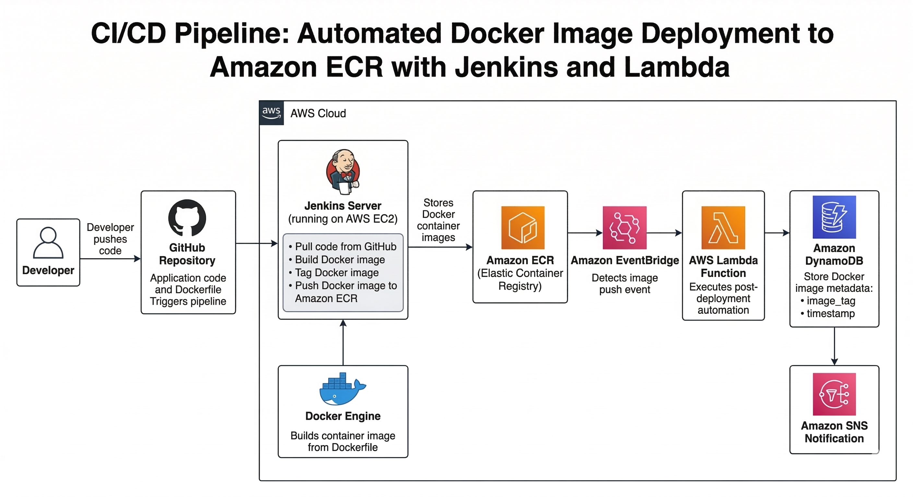
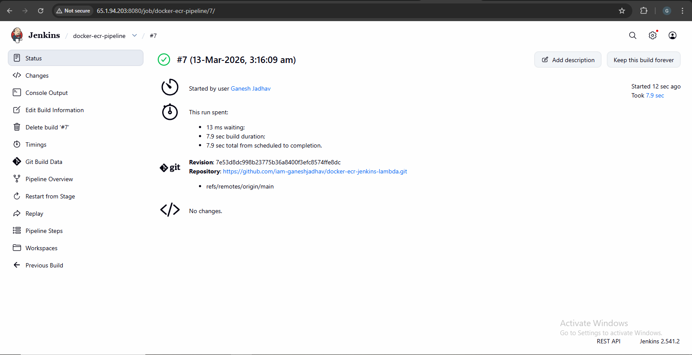
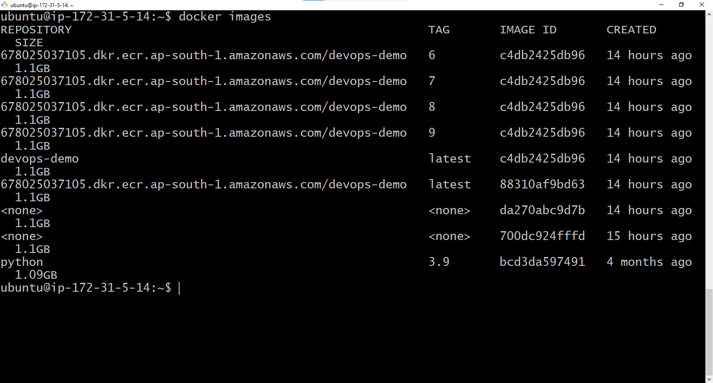
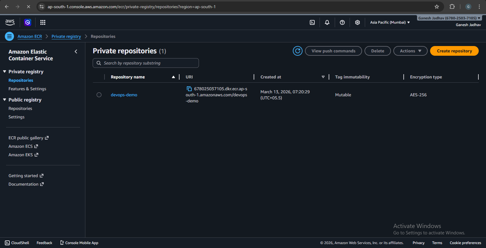
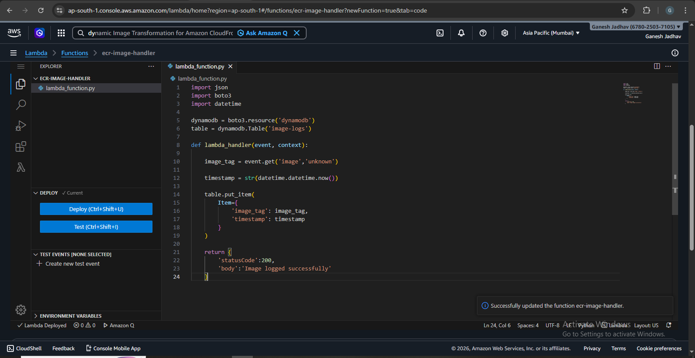
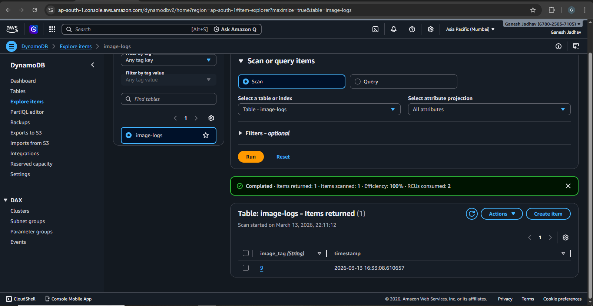
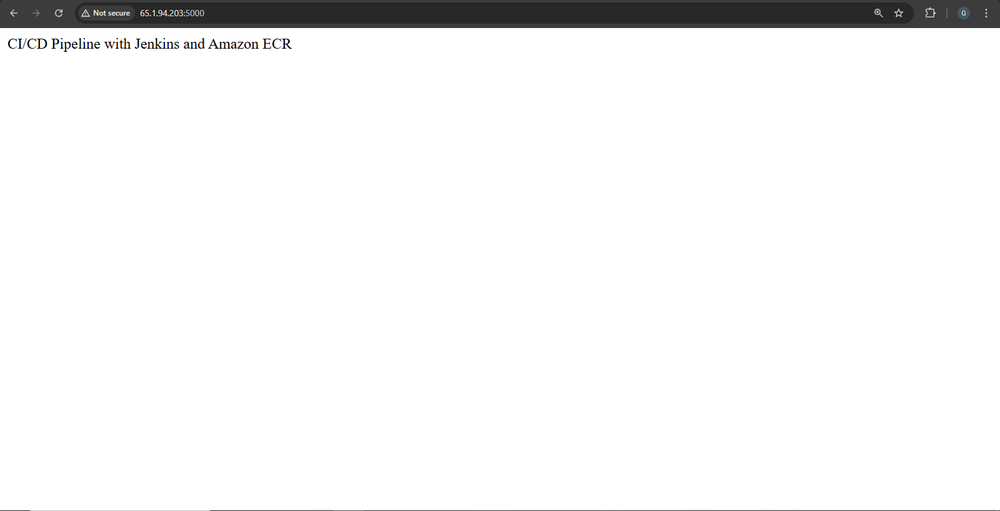

# Automated Docker Image Deployment to Amazon ECR with Jenkins and Lambda Integration

## Project Overview

This project demonstrates a complete **CI/CD pipeline for containerized applications** using Docker, Jenkins, and AWS services. The pipeline automatically builds a Docker image, pushes it to Amazon ECR, and triggers an AWS Lambda function to perform post-deployment tasks such as logging metadata.

The goal of this project is to understand **DevOps automation, container registry management, and event-driven serverless workflows** on AWS.

---

# Architecture Diagram

 

Pipeline Flow:

Developer → GitHub → Jenkins (EC2) → Docker Build → Amazon ECR → EventBridge → AWS Lambda → DynamoDB → SNS Notification

---

# Technologies Used

- Docker
- Jenkins
- Amazon EC2
- Amazon ECR (Elastic Container Registry)
- AWS Lambda
- Amazon EventBridge
- Amazon DynamoDB
- Amazon SNS (optional)
- GitHub
- Python Flask

---

# Project Architecture

1. Developer pushes application code to GitHub.
2. Jenkins pipeline is triggered automatically.
3. Jenkins pulls the latest code from GitHub.
4. Jenkins builds the Docker image using Dockerfile.
5. The image is tagged with a build number.
6. Jenkins authenticates with Amazon ECR.
7. The Docker image is pushed to ECR.
8. Amazon EventBridge detects the image push event.
9. EventBridge triggers an AWS Lambda function.
10. Lambda logs the image metadata to DynamoDB.
11. Optional notification is sent using Amazon SNS.

---

# Project Structure
```
docker-ecr-jenkins-lambda
│
├── app
│ └── app.py
│
├── Dockerfile
│
├── Jenkinsfile
│
├── lambda
│ └── lambda_function.py
│
└── README.md
```

---

# Step 1: Launch Jenkins Server (EC2)

Create an EC2 instance to run Jenkins.

Instance configuration:

Name: Jenkins Server  
AMI: Ubuntu 22.04  
Instance Type: t2.micro  

Security Group Ports:

| Port | Purpose |
|------|--------|
| 22 | SSH |
| 8080 | Jenkins |
| 5000 | Flask App |

Connect to the instance:
```
ssh -i key.pem ubuntu@EC2_PUBLIC_IP
```

---

# Step 2: Install Jenkins

Update system:
```
sudo apt update
```
Install Java:
```
sudo apt install openjdk-17-jdk -y
```

Install Jenkins:
```
curl -fsSL https://pkg.jenkins.io/debian/jenkins.io-2023.key
 | sudo tee
/usr/share/keyrings/jenkins-keyring.asc > /dev/null
```
```
echo deb [signed-by=/usr/share/keyrings/jenkins-keyring.asc]
https://pkg.jenkins.io/debian
 binary/ | sudo tee
/etc/apt/sources.list.d/jenkins.list > /dev/null
```
```
sudo apt update
sudo apt install jenkins -y
```

Start Jenkins:

```
sudo systemctl start jenkins
sudo systemctl enable jenkins   
```

Access Jenkins:

```
http://EC2_PUBLIC_IP:8080
```
```
sudo cat /var/lib/jenkins/secrets/initialAdminPassword
```

---

# Step 3: Install Docker
```
sudo apt install docker.io -y
```

Start Docker:
```
sudo systemctl start docker
sudo systemctl enable docker
```

Allow Jenkins to use Docker:
```
sudo usermod -aG docker jenkins
```

Restart Jenkins:
```
sudo systemctl restart Jenkins
```

---

# Step 4: Install AWS CLI
```
sudo apt install awscli -y      
```

Verify:
```
aws --version
```

Configure credentials:
```
aws configure
```

---

# Step 5: Create Amazon ECR Repository

```
aws ecr create-repository
--repository-name devops-demo
--region ap-south-1
```

Repository URI example:
```
123456789012.dkr.ecr.ap-south-1.amazonaws.com/devops-demo
```

---

# Step 6: Sample Flask Application

app/app.py
```
from flask import Flask

app = Flask(name)

@app.route("/")
def home():
return "CI/CD Pipeline with Jenkins and Amazon ECR"

if name == "main":
app.run(host="0.0.0.0", port=5000)
```

---

# Step 7: Dockerfile

```
FROM python:3.9

WORKDIR /app

COPY app/app.py .

RUN pip install flask

EXPOSE 5000

CMD ["python","app.py"]
```

---

# Step 8: Jenkins Pipeline

Jenkinsfile

```
pipeline {
agent any
environment {
    AWS_REGION = 'ap-south-1'
    ACCOUNT_ID = 'YOUR_ACCOUNT_ID'
    REPO_NAME = 'devops-demo'
    IMAGE_TAG = "${BUILD_NUMBER}"
}

stages {

    stage('Clone Repository') {
        steps {
            git 'https://github.com/YOUR_USERNAME/docker-ecr-jenkins-lambda.git'
        }
    }

    stage('Build Docker Image') {
        steps {
            sh 'docker build -t devops-demo .'
        }
    }

    stage('Login to ECR') {
        steps {
            sh '''
            aws ecr get-login-password --region $AWS_REGION | \
            docker login --username AWS \
            --password-stdin $ACCOUNT_ID.dkr.ecr.$AWS_REGION.amazonaws.com
            '''
        }
    }

    stage('Tag Image') {
        steps {
            sh '''
            docker tag devops-demo:latest \
            $ACCOUNT_ID.dkr.ecr.$AWS_REGION.amazonaws.com/$REPO_NAME:$IMAGE_TAG
            '''
        }
    }

    stage('Push Image') {
        steps {
            sh '''
            docker push \
            $ACCOUNT_ID.dkr.ecr.$AWS_REGION.amazonaws.com/$REPO_NAME:$IMAGE_TAG
            '''
        }
    }
}

post {
    success {
        sh '''
        aws lambda invoke \
        --function-name ecr-image-handler \
        --payload '{"image":"'$IMAGE_TAG'"}' response.json
        '''
    }
}
environment {
    AWS_REGION = 'ap-south-1'
    ACCOUNT_ID = 'YOUR_ACCOUNT_ID'
    REPO_NAME = 'devops-demo'
    IMAGE_TAG = "${BUILD_NUMBER}"
}

stages {

    stage('Clone Repository') {
        steps {
            git 'https://github.com/YOUR_USERNAME/docker-ecr-jenkins-lambda.git'
        }
    }

    stage('Build Docker Image') {
        steps {
            sh 'docker build -t devops-demo .'
        }
    }

    stage('Login to ECR') {
        steps {
            sh '''
            aws ecr get-login-password --region $AWS_REGION | \
            docker login --username AWS \
            --password-stdin $ACCOUNT_ID.dkr.ecr.$AWS_REGION.amazonaws.com
            '''
        }
    }

    stage('Tag Image') {
        steps {
            sh '''
            docker tag devops-demo:latest \
            $ACCOUNT_ID.dkr.ecr.$AWS_REGION.amazonaws.com/$REPO_NAME:$IMAGE_TAG
            '''
        }
    }

    stage('Push Image') {
        steps {
            sh '''
            docker push \
            $ACCOUNT_ID.dkr.ecr.$AWS_REGION.amazonaws.com/$REPO_NAME:$IMAGE_TAG
            '''
        }
    }
}

post {
    success {
        sh '''
        aws lambda invoke \
        --function-name ecr-image-handler \
        --payload '{"image":"'$IMAGE_TAG'"}' response.json
        '''
    }
}
```

---

# Step 9: Lambda Function

lambda/lambda_function.py
```
import json
import boto3
import datetime

dynamodb = boto3.resource('dynamodb')
table = dynamodb.Table('image-logs')

def lambda_handler(event, context):
import json
import boto3
import datetime

dynamodb = boto3.resource('dynamodb')
table = dynamodb.Table('image-logs')

def lambda_handler(event, context):
```

---

# Step 10: DynamoDB Table

Create table:
```
Table Name: image-logs
Partition Key: image_tag
```

Example stored record:
```
image_tag : 12
timestamp : 2026-03-13
```

---

# Sample Pipeline Output

Jenkins Pipeline Stages:

- Clone Code
- Build Docker Image
- Login to ECR
- Tag Docker Image
- Push Image
- Trigger Lambda

Pipeline Status:
```
SUCCESS
```

---

# Screenshots

| Sr No | Screenshot Name | Image |
|------|----------------|-------|
| 1 | Jenkins Pipeline Success |  |
| 2 | Docker Image Build |  |
| 3 | Image Pushed to ECR |  |
| 4 | Lambda Function  |  |
| 5 | DynamoDB Logs |  |
| 6 | Application Running |  |
---

# Learning Outcomes

Through this project I learned:

- CI/CD pipeline automation
- Docker containerization
- Jenkins pipeline configuration
- Amazon ECR image management
- Serverless automation with AWS Lambda
- Event-driven architecture using EventBridge
- Logging metadata using DynamoDB

---

# Future Improvements

- Automatic ECS deployment after image push
- Slack notifications
- Multi-stage Docker builds
- Terraform infrastructure automation

---

# Author

## Ganesh Jadhav

**DevOps | Cloud | AWS | Docker | Jenkins**  
**E-mail:** jadhavg9370@gmail.com  
**GitHub:** https://github.com/iam-ganeshjadhav  
**Linkedin:** https://www.linkedin.com/in/ganesh-jadhav-30813a267/
